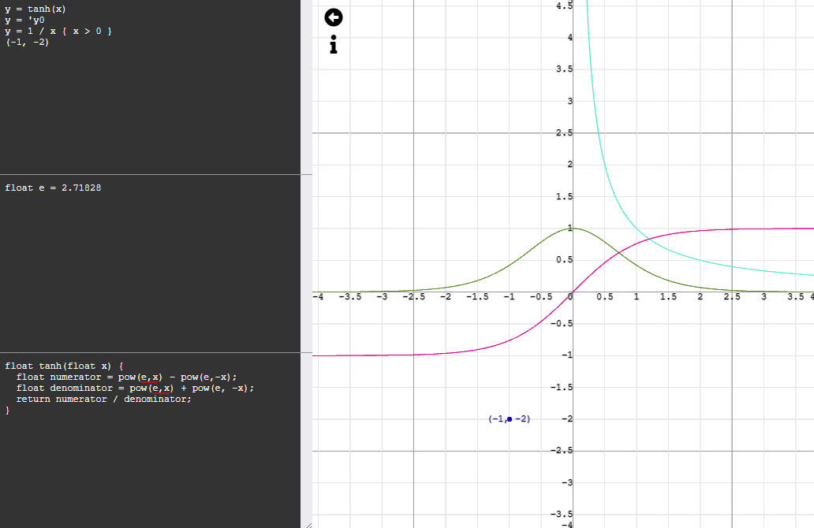

# graph_it

See [Toddez/graphing-calcuator](https://github.com/Toddez/graphing-calculator) for a more recent attempt at a graphing calculator.

--- 

## Installation
``yarn install``  
Install node modules

## Running
``yarn start``  
Runs a express server on port 3000 serving the application

## Features
- ### Parsing:
  - The expressions, constants and functions are parsed into glsl.
  - The parser can expressions such as:
    - Lines:
      - Referencing other variables or functions:
        - ``y = x``
        - ``x = tanh(y)``
      - Constraints:
        - ``y = x { x > 0; y > 0 }`` - Will only plot ``y = x`` where ``x > 0`` and ``y > 0``
    - Points:
      - ``(1, 2)``
    - Derivatives
      - ``y = 'y0`` - Will plot the derivative of the first ``y=`` expression
  - The constants and functions need to be valid glsl (with minor exceptions such as `1` is automatically parsed to `1.0`)
  - Constants and functions are evaluated in order
- ### Displaying results:
  - All expressions are evaluated and rendered on the GPU using WebGL in real time
  - Move around holding left click and dragging mouse
  - Zoom using scroll wheel
